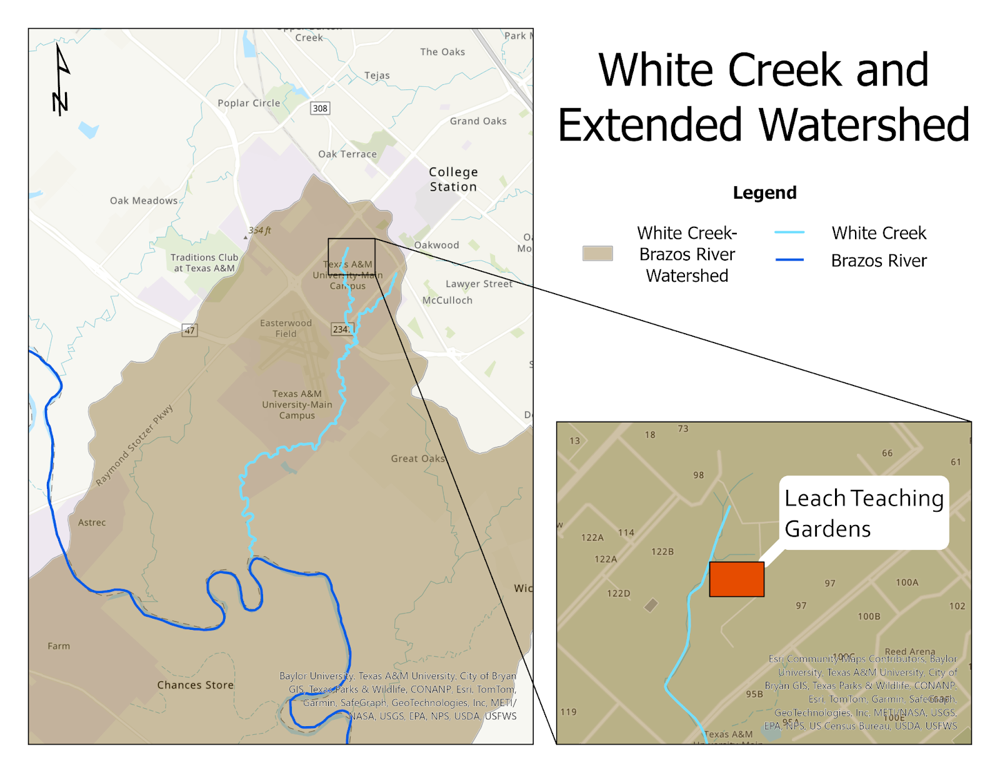

# TAMU Gardens in Focus Time-series

## Who is running this?

TAMU Undergraduates Abigail Day & Meagan Sonsel, as part of [the Hu lab](https://shu251.github.io/sarah-hu/) in the Department of Oceanography.

# White Creek

Is 5 ½ miles long and runs southwest from FM 2818 (at 30°36' N, 96°22' W) to the Brazos River at the Brazos-Burleson county line (at 30°32' N, 96°22' W). Contains deep to shallow clays and sandy loams that traditionally support grasses, live oak, and mesquite.

{width="1000"}

# What is a time-series?

Time-series stations are crucial for understanding and monitoring changing environments over time. These stations collect data at a predetermined interval and record parameters such as temperature, precipitation, atmospheric pressure, and more. Collecting data for extended periods can show scientists trends and patterns that they would not have seen otherwise from a shorter study. In today's changing climate, it is essential to monitor ecosystems and their responses in order to create better and improved mitigation strategies. Time-series stations not only record valuable data but also alert us to anomalies that could potentially cause environmental hazards. A sudden change in temperature or air pressure can allow for a quick investigation and a timely response to a potential environmental hazard. These stations are also helpful for a variety of prediction models and can improve the accuracy for forecasting environmental conditions. The data from these stations can provide the evidence needed to support any policy changes and can even track their effectiveness.

None of this could be done, however, without the continuous sampling of a study area. In our case, monthly sampling provides the perfect balance between practicality and temporal resolution. Many studied environments experience seasonal changes, and monthly monitoring allows researchers to get a clear picture of this without being overwhelmed by data volume. Seasonal changes can show us plant growth, animal migration, and weather patterns, which are crucial to understanding the health and dynamics of an ecosystem. Complex ecosystems cannot be understood in full by a short-term study; continuous monitoring and long-term data collection allow us to see the full picture of an environment. By furthering our understanding through time-series stations, researchers can support their studies and can provide crucial information to weather stations and policymakers.

# Data collected
